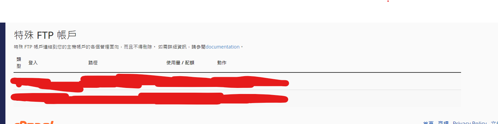
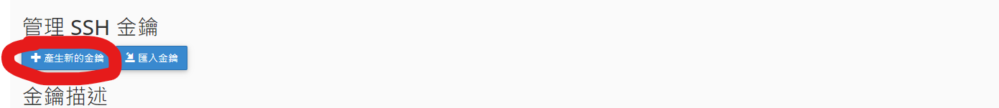
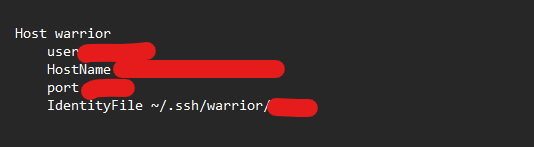

# 第一步:建立ssh
```
ssh-keygen
```
# 建立完 ssh以後 ~/.ssh 將被建立，建立一個config檔案
**先刪掉 剛剛建立的 id_rsa.pub 跟id_rsa**
**因為在主機上建立ssh 比較方便比較快**

去 cpanel ftp 找尋特殊FTP


找尋第一個FTP帳號 為根目錄帳號

#### 根目錄帳號舉例:xxx@xxx-designing.com


### cpanel 打開 ssh存取
ssh存取->管理ssh



產生完金鑰以後

會產生一個私有金鑰與公有金鑰


私有金鑰下載下來貼到.ssh 資料夾任一個地方
**也可以放進資料夾中**

**進行以上動作後，將私有金鑰刪除。**

打開config 配置以下格式:

#### 根目錄帳號舉例:xxx@xxx-designing.com
```
Host warrior
    user 為xxx
    HostName xxx-designing.com
    port 預設19199
    IdentityFile 剛剛下載的ssh金鑰存放位置
```
完成配置，確定ECDSA fingerprint是來自正確的主機便可以確定連線，known_host會記錄一筆主機位置。
便可以運用ssh使用terminal

**如果沒有成功 請使用下列終端**
```
start-ssh-agent
```
即可使用(等同於 ssh -i "${filepath}" 
${user}@${HostName})
```
ssh warrior
```