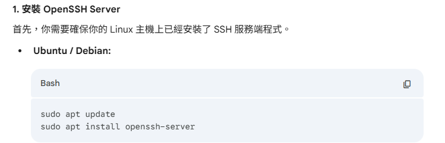
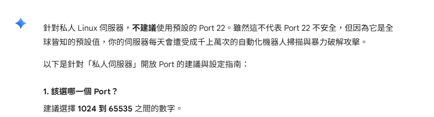
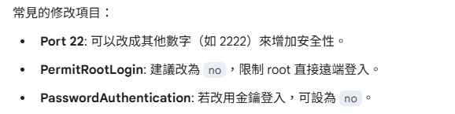
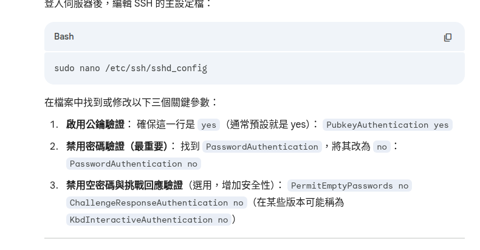
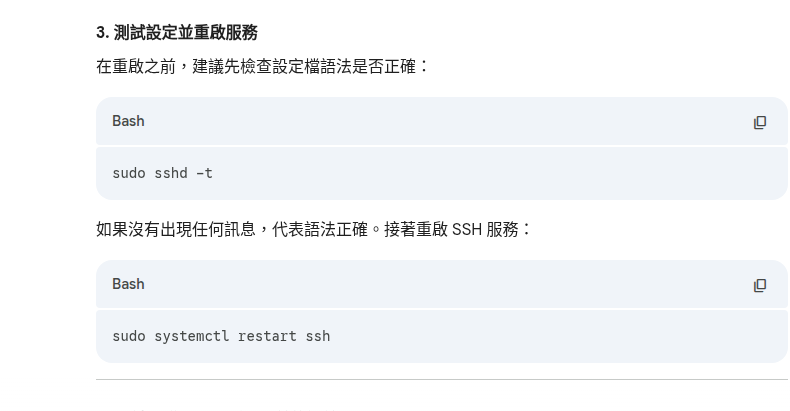

# ssh 開放port連線

```bash
sudo cp /etc/ssh/sshd_config /etc/ssh/sshd_config.bak
```
# 修改ssh 連線項目(可選)
```bash
sudo nano /etc/ssh/sshd_config
```
or
```bash
sudo gedit /etc/ssh/sshd_config
```

# knownhost格式
[-ip]:52222
# 得取known host(伺服器身分，非公鑰)
**範例**
```bash
cat /etc/ssh/ssh_host_ed25519_key.pub
```
# linux 金鑰存放位置，預設都為
```bash
~/.ssh/authorized_keys
```
公鑰都作為字串輸入進入authorized_keys中

# ufw防火牆記得要開內網


# ssh金鑰取代密碼登入的方式


# 重啟服務


# 除錯方式
