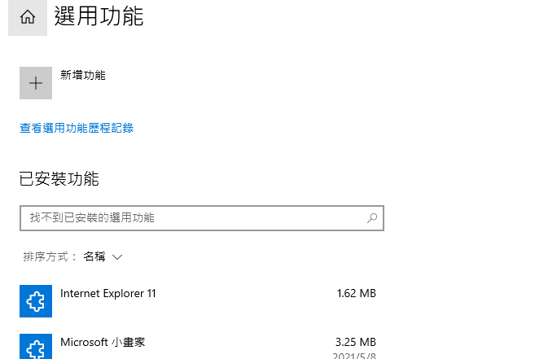
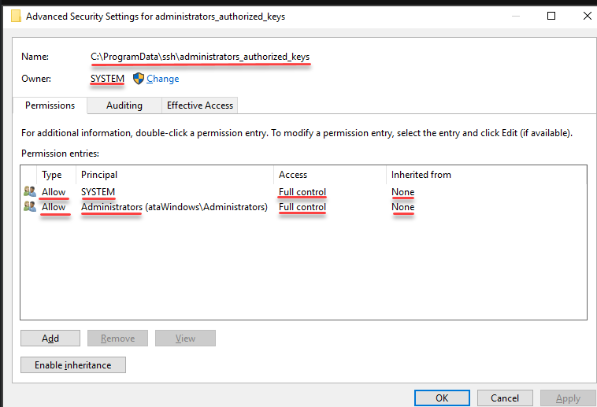

# 安裝 open-ssh


1. 點選 **[選用功能]** 標籤。
2. 在 **[選用功能]** 中，點擊 **[新增功能]**。
3. 搜尋 **[openssh]** 進行安裝。
# 增加客戶端known-host fingerprint

1. 進入C槽，點選 **[檢視]**，開啟 **[隱藏的項目]**。就能看到``C:\ProgramData``。
2. 找到 ``C:\ProgramData\ssh``，若是私鑰編碼為 ed25519 **(預設)** 則複製``ssh_host_ed25519_key``到 client端的knownhost。
3. 找到 ``sshd_config`` 確認authorized_key的位置。進行公鑰部署，你可以參考 [公鑰部署](https://github.com/badtasteNovel/ssh_tutorial/blob/master/git_online/readme.md) 來獲取更多有關 公鑰部暑的資料。
4.  config 預設位置
```
C:\ProgramData\ssh\administrators_authorized_keys 
請創立此檔案，並將金鑰放入這個 text檔案。
```
**請注意** administrators_authorized_keys 並不是一個資料夾 而是一個text file 就像 knownhost 一樣。

# administrators authorized key 的權限

- 嘗試過使用者為Administrator 一樣可行。
- 須將System/Administrator 設置為 /F(完全控制)